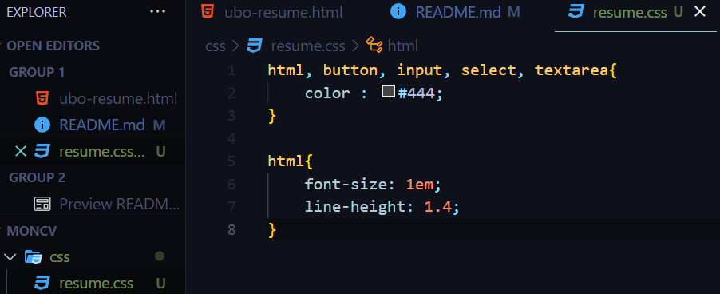

# <mark style="background-color:green;">Structure HTML</mark>

### <mark style="background-color:gray;"> 1.1 Un CV structuré (mais un peu moche) </mark>

#### <mark style="background-color:white;"> 1. Création de la page HTML avec le contenu </mark>


#### <mark style="background-color:white;"> 2. Ajout des informations personnel </mark>

```html
<header>
  <h1>Abdel-jalil EL HASSANI</h1>
  <h2>Étudiant international en double diplomation - DOSI</h2>
  
  <h4>Adresse: 2 rue des arvhives</h4>
  <h4>Äge : 22 ans</h4>
  <h4>Email : abdeljalil.elhassani-etu@etu.univh2c.ma</h4>
  <h4>Nationalité : Marocaine</h4>
  <h4>
    Linkedin :
    <a href="https://www.linkedin.com/in/abdeljalil-elhassani-159258222/"
      >Linkedin</a
    >
  </h4>
  <h4>Github : <a href="https://github.com/AbdeljalilElhassani">Github</a></h4>
</header>
```


#### <mark style="background-color:white;"> 3. ajout des sections </mark>

```html
<section>
  <p>
    Passionné par le génie logiciel et la Data Science. Ma curiosité naturelle
    et mon adaptabilité font de moi un candidat essentiel au sein d’une équipe.
    Motivé par les défis, je suis prêt à élargir mes compétences dans un stage
    en entreprise.
  </p>
  <article>
    <h3>Expériences professionnelles</h3>
    <ul>
      <li>
        <h4>
          Réalisation du front end d’un site web - Faculté des sciences Ben
          M'Sick - Fev 2021 - Juin 2021
        </h4>
      </li>
      <li>
        <h4>
          Projet de fin d'études - Faculté des sciences Ben M'Sick - Jan 2021 -
          Juin 2021
        </h4>
      </li>
      <li>
        <h4>
          Réalisation d'une application Web Smart Agriculture - Faculté des
          sciences Ben M'Sick - Juil 2022 - Sep 2022
        </h4>
      </li>
      <li>
        <h4>
          Conception et réalisation d'une application de gestion d'une boutique
          des smartphones - Faculté des sciences Ben M'Sick - Oct 2022 - Dec
          2022
        </h4>
      </li>
    </ul>
  </article>
  <article>
    <h3>Compétences</h3>
    <ul>
      <li>
        <h4>
          Développement Web : Html, CSS, JavaScript, Bootstrap, jQuery, Java EE,
          Spring
        </h4>
      </li>
      <li>
        <h4>Développement logiciel : PHP, MySQL, Java, C, C++, Python</h4>
      </li>
      <li><h4>Systèmes d'exploitation : Linux, Windows</h4></li>
      <li><h4>Bases de données : Oracle Database, NoSQL,</h4></li>
      <li>
        <h4>Plateforme d’intégration Continue : Git, Gitlab, Github, Docker</h4>
      </li>
      <li><h4>Design : Figma</h4></li>
      <li><h4>Gesion de projet : DevOps, Trello, Agile</h4></li>
      <li>
        <h4>
          Autres compétences techniques : Arduino, Apache Hadoop, Spark, PySpark
        </h4>
      </li>
    </ul>
  </article>
  <article>
    <h3>Formation</h3>
    <ul>
      <li>
        <h4>Baccalauréat en Sciences Mathématiques B - Maroc - 2017/2018</h4>
      </li>
      <li>
        <h4>
          Licence en Sciences Mathématiques et Informatique - UH2C - Maroc -
          2018/2022
        </h4>
      </li>
      <li>
        <h4>
          1ere année Master en Data Science & Big Data - UH2C - Maroc -
          2022/2023
        </h4>
      </li>
      <li>
        <h4>
          2ème année Master en DOSI (Développement logiciel des Systèmes
          d’information) - UBO - France - 2023/2024
        </h4>
      </li>
    </ul>
  </article>
  <article>
    <h3>Langues</h3>
    <ul>
      <li><h4>Anglais : Courant - C1</h4></li>
      <li><h4>Français : Avancé - B2</h4></li>
      <li><h4>Arabe : Maternelle</h4></li>
    </ul>
  </article>
  <article>
    <h3>Certificats</h3>
    <ul>
      <li><h4>Complete Java Programming - Udemy</h4></li>
      <li>
        <h4>Modern PHP Web Development w/ MySQL, GitHub & Heroku - Udemy</h4>
      </li>
      <li><h4>Responsive Web Design - FreeCodeCamp</h4></li>
    </ul>
  </article>
  <article>
    <h3>intérêts</h3>
    <ul>
      <li><h4>Programmation</h4></li>
      <li><h4>Technologies</h4></li>
      <li><h4>Sports</h4></li>
      <li><h4>Lecture</h4></li>
    </ul>
  </article>
  <article>
    <h3>Qualités</h3>
    <ul>
      <li><h4>Créativité</h4></li>
      <li><h4>Collaboration</h4></li>
      <li><h4>Adaptabilité</h4></li>
      <li><h4>Curiousité</h4></li>
    </ul>
  </article>
</section>
```

#### <mark style="background-color:white;"> 4. Ajout de footer </mark>

```html
<footer>
  <a href="https://github.com/AbdeljalilElhassani">Github</a>
  <a href="https://www.linkedin.com/in/abdeljalil-elhassani-159258222/"
    >Linkedin</a
  >
  <a href="mailto:abdeljalil.elhassani-etu@etu.univh2c.ma">Gmail</a>
</footer>
```

#### <mark style="background-color:white;"> 5. Test de l'affichage </mark>


#### <mark style="background-color:white;"> 6. Ajout de fichier dans git avec le tag "Structure" </mark>

```shell
git add .
git commit -m "add structure file"
git tag -a structure -m "structure"
git remote add origin https://github.com/AbdeljalilElhassani/DCW.git
git push origin main --tags
```


# <mark style="background-color:green;">Un peu de style</mark>

### <mark style="background-color:gray;"> 1. Ajout de fichier css/resume.css</mark>



### <mark style="background-color:gray;"> 2. Ajout de fichier css dans le head</mark>


### <mark style="background-color:gray;"> 3. Modification de resume.css </mark>

#### <mark style="background-color:white;"> a. fond de page #777 </mark>

Pour avoir un fond de page #777, on ajoute le code suivant dans le fichier resume.css :

```css
body {
  background-color: #777;
}
```

#### <mark style="background-color:white;"> b. Largeur maximale et minimale de div wrapper </mark>

Pour définir une largeur maximale et minimale et centrer le contenu de la balise div avec l'id wrapper, on ajout le code css suivant :

```css
#wrapper {
  max-width: 900px;
  min-width: 320px;
  margin: auto;
}
```

#### <mark style="background-color:white;"> c. Modification de header</mark>

Pour modifier et aligner l'image dans le header, on va ajouter le code suivant :

```css
header img {
  float: right;
  border: 1px solid #ccc;
  border-radius: 3px;
  background-color: white;
  box-shadow: 0 2px 4px rgba(0, 0, 0, 0.2);
}
```

### <mark style="background-color:gray;"> 4.Les polices d'icônes "Font Awesome" </mark>

#### <mark style="background-color:white;"> a. Ajout de lien dans l'HTML</mark>


#### <mark style="background-color:white;"> b. Test de lien de font awesome </mark>

Pour tester que le lien marche bien, on va ajouter la ligne suivante :

```html
<i class="fa-solid fa-camera-retro"></i>
```

et aussi le code suivant :

```html
<script
  src="https://kit.fontawesome.com/9a057acc47.js"
  crossorigin="anonymous"
></script>
```


### <mark style="background-color:gray;"> 5. Changement de police de caractères</mark>

#### <mark style="background-color:white;"> Changement de font en utilisant Google Fonts </mark>

En choisissant notre font, google font va nous genérer un lien à ajouter dans notre page html :


On ajoute le lien dans notre page html :


Modification de fichier css pour appliquer le font au Nom :

```css
header h1 {
  font-family: "Dancing Script", cursive;
}
```

Affichage :


Ajout d'autres fonts :


#### <mark style="background-color:white;"> Push to Git </mark>

Pour valider les modifications avec un tag CSS, on utilise les commandes suivantes :

```shell
git add .
git commit -m "Feat : Ajout de code css"
git tag -a CSS -m "CSS"
git push origin main --tags
```

Vérification :


